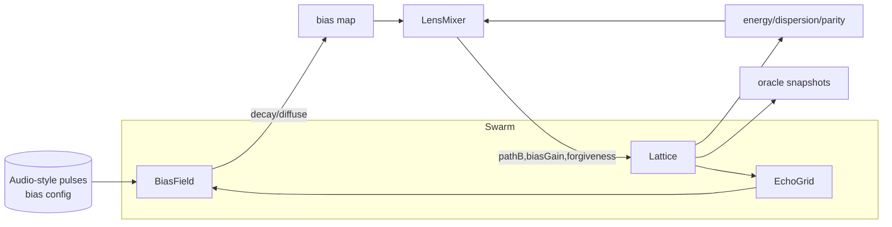

# LKB Codebase Master Synthesis
*Generated: 2026-01-02 20:09:34 UTC*  
*Scope: docs/; prototypes/LKB_POCs/; prototypes/Toys/; prototypes/AI_Deltas/LKB/*

**Inventory stats**
- Files: 415; Total bytes: 1,111,335
- By type: .js 230; .md 56; .py 57; .html 30; .json 29; .css 4; .log 2; .txt 6; noext 1
- Sensitive files skipped: 0

**Warnings**
- Several JS/HTML implementations share patterns; synthesis leans on READMEs/configs for intent, with limited deep code inspection in some sibling variants. [Partial Read]

---

## Table of Contents
- [Executive Summary](#executive-summary)
- [Architecture Overview](#architecture-overview)
- [Concept Registry](#concept-registry)
- [Component / Module Map](#component--module-map)
- [Delta Timeline / Upgrade Path](#delta-timeline--upgrade-path)
- [Configuration & Tunables Index](#configuration--tunables-index)
- [Testing & Verification Map](#testing--verification-map)
- [Contradictions, Unknowns, and Open Questions](#contradictions-unknowns-and-open-questions)
- [Do Not Re-Develop List](#do-not-re-develop-list)
- [Full File Index (Appendix)](#full-file-index-appendix)

---

## Executive Summary
The Lyriel/Kairi Brain (LKB) codebase explores PhaseCube-style ternary-phase lattices (plasma/liquid/solid with parity) as a minimal, influence-only “dreaming” substrate. The design map stresses decentralization, harmonic safety, and four-lens governance (human, predictive, systemic, harmonic) to keep emergent behavior bounded yet expressive. (F001: docs/Parallel-Paradox-Design.md)  
Browser POCs and toy sketches showcase interactive, audio-biased grids, while numerous deltas package headless JS or Python runners with tunable bias fields, lens mixers, and forgiveness damping. (F406: prototypes/LKB_POCs/readme.md) (F004: prototypes/AI_Deltas/LKB/260102193929_BUCPOW8V/README.md)  
Across deltas, recurring motifs include decaying bias pulses mapped from depth/pan semantics, Path A/B mixing with clamps, delay-line or multi-grid echoes, and oracle/witness snapshots for observability. The upgrade trajectory moves from single-grid HTML toys toward CLI-driven, test-backed simulators suitable for automation and future renderers.

Top load-bearing concepts: PhaseCube lattice; Path A/B branch mixing; decaying bias field; four-lens mixer with forgiveness; tri-/multi-grid swarms with delay memory.

---

## Architecture Overview

- **Runtime today:** Mostly headless CLI runners (Node or Python) stepping lattices with optional multi-grid coupling and emitting JSON summaries plus witness samples. (F004: prototypes/AI_Deltas/LKB/260102193929_BUCPOW8V/README.md) (F017: prototypes/AI_Deltas/LKB/260102193930_7LH8S4Z7/README.md)
- **Intended direction:** Preserve influence-not-command biasing, add harmonics/forgiveness for safety, and layer lens-aware modulation plus delay memory. Rendering/audio are pluggable TODOs across deltas. (F226: prototypes/AI_Deltas/LKB/LKBDLT24A1B7/README.md) (F250: prototypes/AI_Deltas/LKB/LKBX24M9Q7P1/README.md)

---

## Concept Registry
### C001 — PhaseCube Lattice
Ternary-phase toroidal grid (plasma, liquid, solid) with parity bit; updates blend neighbor differences (Path B) vs averages (Path A) plus damping. (Status: Implemented) (F406: prototypes/LKB_POCs/readme.md) (F229: prototypes/AI_Deltas/LKB/LKBDLT24A1B7/src/phasecube_delta/cli.py)

### C002 — Path A/B Mixing
Stochastic branch chooser: Path A averages phases; Path B amplifies differences plus parity; probabilities clamp within safety bounds. (Status: Implemented) (F405: prototypes/LKB_POCs/phasecube_dreaming_0001.html) (F008: prototypes/AI_Deltas/LKB/260102193929_BUCPOW8V/src/lattice.js)

### C003 — Bias Field (Influence, Not Command)
Decaying/diffusing 3D field injected via pulses (depth/pan/amplitude) that nudge lattice probabilities without overwriting state. (Status: Implemented) (F004: prototypes/AI_Deltas/LKB/260102193929_BUCPOW8V/README.md) (F254: prototypes/AI_Deltas/LKB/LKBX24M9Q7P1/src/bias-field.js)

### C004 — Four-Lens Mixer
Weights (human, predictive, systemic, harmonic) normalize to adjust Path B probability, bias gain, and forgiveness damping, keeping exploration/stability balanced. (Status: Implemented) (F001: docs/Parallel-Paradox-Design.md) (F017: prototypes/AI_Deltas/LKB/260102193930_7LH8S4Z7/README.md)

### C005 — Forgiveness / Harmonic Damping
When dispersion crosses thresholds, branch weights/damping reduce divergence, blending back toward averages. (Status: Implemented) (F226: prototypes/AI_Deltas/LKB/LKBDLT24A1B7/README.md) (F195: prototypes/AI_Deltas/LKB/LKBDELTA240401A/README.md)

### C006 — Decaying Delay / Memory Line
Rolling buffer of prior bias/energy re-injected softly to create echoes without hard memory. (Status: Prototype) (F250: prototypes/AI_Deltas/LKB/LKBX24M9Q7P1/README.md) (F017: prototypes/AI_Deltas/LKB/260102193930_7LH8S4Z7/README.md)

### C007 — Multi-Grid / Swarm Coupling
Core, echo, and memory grids exchange softened bias or cross-talk to sustain patterns while avoiding collapse. (Status: Prototype) (F187: prototypes/AI_Deltas/LKB/LKB7X9G2/lenses.js) (F260: prototypes/AI_Deltas/LKB/LKBX24M9Q7P1/src/swarm.js)

### C008 — Oracle / Witness Sampling
Lightweight snapshot of selected cells to observe swarm state without halting; aligns with distributed repository idea. (Status: Prototype) (F004: prototypes/AI_Deltas/LKB/260102193929_BUCPOW8V/README.md) (F234: prototypes/AI_Deltas/LKB/LKBQ7W9C4D2F1/README.md)

### C009 — Audio-Style Pulse Mapping
Input semantics: low frequency → depth; stereo pan → lateral bias; amplitude → strength; optionally synthesized when mic unavailable. (Status: Implemented) (F276: prototypes/LKB_POCs/98E66S/README.md) (F345: prototypes/LKB_POCs/AI_Deltas/T4H9K2/README.md)

### C010 — Structural Plasticity Hooks
Probabilistic rewiring or trace layers to diversify topology while retaining bounded behavior. (Status: Planned/Prototype) (F250: prototypes/AI_Deltas/LKB/LKBX24M9Q7P1/README.md) (F345: prototypes/LKB_POCs/AI_Deltas/T4H9K2/src/core/controller.js)

### C011 — Anti-Singularity Ethos
Design stance: decentralization, mutual aid, transparency, and bounded agency; avoid central controllers. (Status: Implemented in docs) (F001: docs/Parallel-Paradox-Design.md)

### C012 — Kenotic Forgiveness Operator
Damps coupling when dispersion exceeds love/variance threshold, inspired by kenotic N-body motif. (Status: Implemented) (F001: docs/Parallel-Paradox-Design.md) (F226: prototypes/AI_Deltas/LKB/LKBDLT24A1B7/README.md)

---

## Component / Module Map
- **Phase Lattice (JS/Python):** Maintains plasma/liquid/solid/parity arrays, perturbation noise, neighbor sampling, Path A/B branch, and forgiveness damping. Implementations in Node (e.g., `lattice.js` in 260102193929_BUCPOW8V) and Python (`simulation.py` in LKBDLT24A1B7). Inputs: bias map, lens mix. Outputs: updated states, metrics. (F011: prototypes/AI_Deltas/LKB/260102193929_BUCPOW8V/src/runner.js) (F231: prototypes/AI_Deltas/LKB/LKBDLT24A1B7/src/phasecube_delta/simulation.py)
- **BiasField / InputLayer:** Decays bias each tick; injects radial pulses from scheduled events or audio bins; clamps influence. Inputs: pulse schedule or analyzer tuples. Outputs: bias array, bias energy metric. (F006: prototypes/AI_Deltas/LKB/260102193929_BUCPOW8V/src/bias.js) (F325: prototypes/LKB_POCs/AI_Deltas/NCECI6/README.md)
- **Lens Mixer:** Normalizes lens weights, computes pathB probability, forgiveness factor, and bias gain from metrics (energy, dispersion, bias energy). Inputs: metrics, config weights. Outputs: modulated parameters for lattice. (F009: prototypes/AI_Deltas/LKB/260102193929_BUCPOW8V/src/lens.js) (F236: prototypes/AI_Deltas/LKB/LKBQ7W9C4D2F1/README.md)
- **Swarm Orchestrators:** Wire bias → lens → lattice across multiple grids, manage delay lines, collect metrics and witnesses (e.g., `runner.js`, `swarm.js`, Python `run.py`). (F024: prototypes/AI_Deltas/LKB/260102193930_7LH8S4Z7/src/run.py) (F260: prototypes/AI_Deltas/LKB/LKBX24M9Q7P1/src/swarm.js)
- **CLI Entrypoints:** Provide headless execution with tunables (grid size, steps, probabilities, forgiveness thresholds). Examples: `src/main.js` (BUCPOW8V), `phasecube_delta/cli.py` (LKBDLT24A1B7). (F010: prototypes/AI_Deltas/LKB/260102193929_BUCPOW8V/src/main.js) (F229: prototypes/AI_Deltas/LKB/LKBDLT24A1B7/src/phasecube_delta/cli.py)
- **HTML/Canvas Renderers:** Early POCs (hearing tests, galaxy brain) render lattice projections, hook into mic/synth, and expose UI sliders. Inputs: audio analyzer bins, mouse rotation. Outputs: canvas frames, PNG snapshots. (F409: prototypes/Toys/Hearing_test_0003.html) (F407: prototypes/Toys/Galaxybrain_clean_minimal.html)

---

## Delta Timeline / Upgrade Path
| DeltaID | Created (UTC) | Summary | Breaking? |
| --- | --- | --- | --- |
| LKBDLT24A1B7 | 2026-01-02T18:31:10Z | Configurable PhaseCube lattice with harmonic/forgiveness damping (Python) | False |
| LKBX24M9Q7P1 | 2026-01-02T18:31:49Z | Lens-aware multi-grid with delay-biased coupling (Node) | False |
| D3T4L7A9B12C | 2026-01-02T18:31:05Z | Lens-aware tri-grid swarm runner with delay coupling (Node) | False |
| LKB20250314A1B2 | 2026-01-02T19:17:25Z | Headless lens mixer with decaying bias and delay-line persistence | False |
| LKBDELTA240401A | 2026-01-02T19:24:55Z | Modular lattice with bias fields and forgiveness; CLI demo | False |
| LKB20250326X7A9 | 2026-01-02T19:26:32Z | Audio-biased lens mixer mapping stereo bins into bounded lattice | False |
| LKB20250329X7N4 | 2026-01-02T19:27:38Z | Dual-grid scenario runner with lens-gated blending and forgiveness | False |
| LKBX52D7M9Q3 | 2026-01-02T19:25:15Z | Headless lens-gated bias runner with forgiveness and witnesses | False |
| LKBQ7W9C4D2F1 | 2026-01-02T18:45:51Z | Headless core with lens-aware biasing and damping | False |
| A9C3F7L2P5R8 | 2026-01-02T18:56:08Z | Lens-scheduled tri-grid with bias memory and forgiveness | False |
| D7F3L9P2Q5R8 | 2026-01-02T18:56:35Z | Tri-grid swarm with bias/delay feedback and plasticity | False |
| DX7F9L2Q1A3B | 2026-01-02T18:58:12Z | Lens-guided tri-grid with decaying spectral bias | False |
| 260102193929_BUCPOW8V | 2026-01-02T19:40:58Z | Headless lens-aware runner with audio-style pulses and forgiveness | False |
| 260102193930_7LH8S4Z7 | 2026-01-02T19:41:25Z | Python dual-grid lens-gated runner with bias pulses | False |
| 260102193932_UAOPAG61 | 2026-01-02T19:41:39Z | Tri-grid bias routing with delay memory and oracle sampling | False |
| 260102193935_88YZJWBB | 2026-01-02T19:41:47Z | Deterministic Python bias-pulse runner with lens gating | False |

**Upgrade narrative:** Early deltas formalize headless lattice runners with forgiveness (LKBDLT24A1B7) and branch into multi-grid, delay, and lens fusion (LKBX24M9Q7P1, D3T4L7A9B12C). Mid-line deltas add bias pulses, delay persistence, and CLI tooling. Recent 260102-series deltas harden headless bias pipelines (Node and Python), emphasizing lens clamps, deterministic pulses, and oracle sampling. Converging path: unify lens mixer semantics and bias pulse schemas, standardize metrics/witness outputs, and keep renderer/audio hooks optional.

---

## Configuration & Tunables Index
- **Grid size/dimensions:** `grid`, `gridSize` (Python/JS runners) control n³ cells. (F226: prototypes/AI_Deltas/LKB/LKBDLT24A1B7/README.md) (F004: prototypes/AI_Deltas/LKB/260102193929_BUCPOW8V/README.md)
- **Path probabilities:** `path_b_p`, `basePathB`, `pathBClamp` tune Path B mixing bounds. (F229: prototypes/AI_Deltas/LKB/LKBDLT24A1B7/src/phasecube_delta/cli.py) (F007: prototypes/AI_Deltas/LKB/260102193929_BUCPOW8V/src/config.js)
- **Noise/perturbation:** `flip_p`, `parity_p`, `FLIP_P`, `PARITY_P` seed stochasticity. (F405: prototypes/LKB_POCs/phasecube_dreaming_0001.html) (F226: prototypes/AI_Deltas/LKB/LKBDLT24A1B7/README.md)
- **Damping/memory:** `alpha`, `forgiveness_blend`, `forgivenessThreshold`, `traceBlend` shape solid/memory blending and kenotic damping. (F226: prototypes/AI_Deltas/LKB/LKBDLT24A1B7/README.md) (F250: prototypes/AI_Deltas/LKB/LKBX24M9Q7P1/README.md)
- **Bias field:** `decay`, `strength`, `radius`, `biasGain` scale influence-only bias and diffusion. (F004: prototypes/AI_Deltas/LKB/260102193929_BUCPOW8V/README.md) (F276: prototypes/LKB_POCs/98E66S/README.md)
- **Lens weights:** `human`, `predictive`, `systemic`, `harmonic` adjust exploration vs. stability; often normalized. (F001: docs/Parallel-Paradox-Design.md) (F236: prototypes/AI_Deltas/LKB/LKBQ7W9C4D2F1/README.md)
- **Delay/echo:** `delay.length/decay/gain`, `echo_gain`, `memoryBiasGain` control feedback strength. (F017: prototypes/AI_Deltas/LKB/260102193930_7LH8S4Z7/README.md) (F250: prototypes/AI_Deltas/LKB/LKBX24M9Q7P1/README.md)
- **Pulse schedules:** arrays of `{time, depth, pan, amplitude}` define deterministic bias injections. (F007: prototypes/AI_Deltas/LKB/260102193929_BUCPOW8V/src/config.js) (F032: prototypes/AI_Deltas/LKB/260102193932_UAOPAG61/README.md)

---

## Testing & Verification Map
- **Node deltas:** npm scripts running smoke/unit suites (e.g., lens clamps, bias decay, witness presence). (F013: prototypes/AI_Deltas/LKB/260102193929_BUCPOW8V/tests/run-tests.js) (F275: prototypes/AI_Deltas/LKB/LKBX52D7M9Q3/tests/simulation.test.js)
- **Python deltas:** pytest or unittest smoke plus logic tests (neighbor wrapping, forgiveness behavior). (F232: prototypes/AI_Deltas/LKB/LKBDLT24A1B7/tests/test_simulation.py) (F027: prototypes/AI_Deltas/LKB/260102193930_7LH8S4Z7/tests/test_grid.py)
- **HTML toys/POCs:** manual interactive use; no automated tests present. (F407: prototypes/Toys/Galaxybrain_clean_minimal.html)

Coverage gaps: renderer/UI layers largely untested; multi-grid cross-talk safety relies on unit heuristics rather than property-based tests.

---

## Contradictions, Unknowns, and Open Questions
- **Lens mixer variance:** Multiple deltas implement lens-to-pathB formulas differently; need convergence on a canonical mapping. (F009: prototypes/AI_Deltas/LKB/260102193929_BUCPOW8V/src/lens.js) (F236: prototypes/AI_Deltas/LKB/LKBQ7W9C4D2F1/README.md)
- **Bias pulse schema consistency:** Pulse fields (`depth/pan/amplitude` vs. band-based pulses) vary across POCs and deltas. Standardize for interoperability. (F276: prototypes/LKB_POCs/98E66S/README.md) (F032: prototypes/AI_Deltas/LKB/260102193932_UAOPAG61/README.md)
- **Memory/trace semantics:** Trace layers and delay lines coexist with no single spec for their interaction with forgiveness. Clarify ordering and clamping. (F258: prototypes/AI_Deltas/LKB/LKBX24M9Q7P1/src/grid.js) (F187: prototypes/AI_Deltas/LKB/LKB7X9G2/lenses.js)
- **Testing scope:** UI/audio pipelines lack automation; decision whether to add headless audio simulators for regression remains open. (F409: prototypes/Toys/Hearing_test_0003.html)

---

## Do Not Re-Develop List
- **Phase lattice core:** Reuse existing Path A/B lattice modules (JS `lattice.js`, Python `simulation.py`) instead of re-implementing neighbor logic. (F011: prototypes/AI_Deltas/LKB/260102193929_BUCPOW8V/src/runner.js) (F231: prototypes/AI_Deltas/LKB/LKBDLT24A1B7/src/phasecube_delta/simulation.py)
- **Lens mixer patterns:** Consolidate around existing four-lens mixers rather than creating new ad-hoc weighting schemes. (F004: prototypes/AI_Deltas/LKB/260102193929_BUCPOW8V/README.md) (F236: prototypes/AI_Deltas/LKB/LKBQ7W9C4D2F1/README.md)
- **Bias pulse handling:** Leverage established BiasField/InputLayer implementations with decay, radius, and clamp semantics. (F006: prototypes/AI_Deltas/LKB/260102193929_BUCPOW8V/src/bias.js) (F276: prototypes/LKB_POCs/98E66S/README.md)
- **Forgiveness damping:** Extend the kenotic/forgiveness operator already embedded in deltas rather than inventing new stabilization knobs. (F226: prototypes/AI_Deltas/LKB/LKBDLT24A1B7/README.md)

---

## Full File Index (Appendix)
## Full File Index (Appendix)
Grouped by directory; includes file IDs from inventory.

### docs/
- F001 docs/Parallel-Paradox-Design.md

### prototypes/LKB_POCs/
- F276 prototypes/LKB_POCs/98E66S/README.md
- F277 prototypes/LKB_POCs/98E66S/index.html
- F278 prototypes/LKB_POCs/98E66S/js/audioEngine.js
- F279 prototypes/LKB_POCs/98E66S/js/config.js
- F280 prototypes/LKB_POCs/98E66S/js/inputField.js
- F281 prototypes/LKB_POCs/98E66S/js/main.js
- F282 prototypes/LKB_POCs/98E66S/js/phaseGrid.js
- F283 prototypes/LKB_POCs/98E66S/js/renderer.js
- F284 prototypes/LKB_POCs/98E66S/js/ui.js
- F285 prototypes/LKB_POCs/98E66S/js/utils.js
- F286 prototypes/LKB_POCs/98E66S/styles.css
- F287 prototypes/LKB_POCs/AI_Deltas/A6P9Q4/README.md
- F288 prototypes/LKB_POCs/AI_Deltas/A6P9Q4/config.js
- F289 prototypes/LKB_POCs/AI_Deltas/A6P9Q4/controls.js
- F290 prototypes/LKB_POCs/AI_Deltas/A6P9Q4/index.html
- F291 prototypes/LKB_POCs/AI_Deltas/A6P9Q4/lattice.js
- F292 prototypes/LKB_POCs/AI_Deltas/A6P9Q4/lenses.js
- F293 prototypes/LKB_POCs/AI_Deltas/A6P9Q4/main.js
- F294 prototypes/LKB_POCs/AI_Deltas/A6P9Q4/renderer.js
- F295 prototypes/LKB_POCs/AI_Deltas/B4M7Q9/README.md
- F296 prototypes/LKB_POCs/AI_Deltas/B4M7Q9/index.html
- F297 prototypes/LKB_POCs/AI_Deltas/B4M7Q9/js/biasField.js
- F298 prototypes/LKB_POCs/AI_Deltas/B4M7Q9/js/config.js
- F299 prototypes/LKB_POCs/AI_Deltas/B4M7Q9/js/controls.js
- F300 prototypes/LKB_POCs/AI_Deltas/B4M7Q9/js/main.js
- F301 prototypes/LKB_POCs/AI_Deltas/B4M7Q9/js/phaseGrid.js
- F302 prototypes/LKB_POCs/AI_Deltas/B4M7Q9/js/renderer.js
- F303 prototypes/LKB_POCs/AI_Deltas/B4M7Q9/styles.css
- F304 prototypes/LKB_POCs/AI_Deltas/F6N2Q4/README.md
- F305 prototypes/LKB_POCs/AI_Deltas/F6N2Q4/config.js
- F306 prototypes/LKB_POCs/AI_Deltas/F6N2Q4/index.html
- F307 prototypes/LKB_POCs/AI_Deltas/F6N2Q4/main.js
- F308 prototypes/LKB_POCs/AI_Deltas/F6N2Q4/renderer.js
- F309 prototypes/LKB_POCs/AI_Deltas/F6N2Q4/swarm.js
- F310 prototypes/LKB_POCs/AI_Deltas/J8L2Q9/README.md
- F311 prototypes/LKB_POCs/AI_Deltas/J8L2Q9/app.js
- F312 prototypes/LKB_POCs/AI_Deltas/J8L2Q9/config.js
- F313 prototypes/LKB_POCs/AI_Deltas/J8L2Q9/index.html
- F314 prototypes/LKB_POCs/AI_Deltas/M8K3Z1/README.md
- F315 prototypes/LKB_POCs/AI_Deltas/M8K3Z1/index.html
- F316 prototypes/LKB_POCs/AI_Deltas/M8K3Z1/js/biasField.js
- F317 prototypes/LKB_POCs/AI_Deltas/M8K3Z1/js/config.js
- F318 prototypes/LKB_POCs/AI_Deltas/M8K3Z1/js/lenses.js
- F319 prototypes/LKB_POCs/AI_Deltas/M8K3Z1/js/main.js
- F320 prototypes/LKB_POCs/AI_Deltas/M8K3Z1/js/phaseGrid.js
- F321 prototypes/LKB_POCs/AI_Deltas/M8K3Z1/js/renderer.js
- F322 prototypes/LKB_POCs/AI_Deltas/M8K3Z1/js/ui.js
- F323 prototypes/LKB_POCs/AI_Deltas/M8K3Z1/js/utils.js
- F324 prototypes/LKB_POCs/AI_Deltas/M8K3Z1/styles.css
- F325 prototypes/LKB_POCs/AI_Deltas/NCECI6/README.md
- F326 prototypes/LKB_POCs/AI_Deltas/NCECI6/config.js
- F327 prototypes/LKB_POCs/AI_Deltas/NCECI6/controls.js
- F328 prototypes/LKB_POCs/AI_Deltas/NCECI6/grid.js
- F329 prototypes/LKB_POCs/AI_Deltas/NCECI6/index.html
- F330 prototypes/LKB_POCs/AI_Deltas/NCECI6/input-layer.js
- F331 prototypes/LKB_POCs/AI_Deltas/NCECI6/lens.js
- F332 prototypes/LKB_POCs/AI_Deltas/NCECI6/main.js
- F333 prototypes/LKB_POCs/AI_Deltas/NCECI6/renderer.js
- F334 prototypes/LKB_POCs/AI_Deltas/NCECI6/utils.js
- F335 prototypes/LKB_POCs/AI_Deltas/Q4X9Z2/README.md
- F336 prototypes/LKB_POCs/AI_Deltas/Q4X9Z2/biasField.js
- F337 prototypes/LKB_POCs/AI_Deltas/Q4X9Z2/config.js
- F338 prototypes/LKB_POCs/AI_Deltas/Q4X9Z2/controls.js
- F339 prototypes/LKB_POCs/AI_Deltas/Q4X9Z2/grid.js
- F340 prototypes/LKB_POCs/AI_Deltas/Q4X9Z2/index.html
- F341 prototypes/LKB_POCs/AI_Deltas/Q4X9Z2/input.js
- F342 prototypes/LKB_POCs/AI_Deltas/Q4X9Z2/lens.js
- F343 prototypes/LKB_POCs/AI_Deltas/Q4X9Z2/main.js
- F344 prototypes/LKB_POCs/AI_Deltas/Q4X9Z2/renderer.js
- F345 prototypes/LKB_POCs/AI_Deltas/T4H9K2/README.md
- F346 prototypes/LKB_POCs/AI_Deltas/T4H9K2/index.html
- F347 prototypes/LKB_POCs/AI_Deltas/T4H9K2/src/config.js
- F348 prototypes/LKB_POCs/AI_Deltas/T4H9K2/src/core/audio.js
- F349 prototypes/LKB_POCs/AI_Deltas/T4H9K2/src/core/controller.js
- F350 prototypes/LKB_POCs/AI_Deltas/T4H9K2/src/core/inputField.js
- F351 prototypes/LKB_POCs/AI_Deltas/T4H9K2/src/core/lensScheduler.js
- F352 prototypes/LKB_POCs/AI_Deltas/T4H9K2/src/core/memoryField.js
- F353 prototypes/LKB_POCs/AI_Deltas/T4H9K2/src/core/phaseGrid.js
- F354 prototypes/LKB_POCs/AI_Deltas/T4H9K2/src/core/render.js
- F355 prototypes/LKB_POCs/K5N3Q8/README.md
- F356 prototypes/LKB_POCs/K5N3Q8/config.js
- F357 prototypes/LKB_POCs/K5N3Q8/controls.js
- F358 prototypes/LKB_POCs/K5N3Q8/grid.js
- F359 prototypes/LKB_POCs/K5N3Q8/index.html
- F360 prototypes/LKB_POCs/K5N3Q8/input-layer.js
- F361 prototypes/LKB_POCs/K5N3Q8/main.js
- F362 prototypes/LKB_POCs/K5N3Q8/renderer.js
- F363 prototypes/LKB_POCs/K5N3Q8/utils.js
- F364 prototypes/LKB_POCs/L7Q9XK/README.md
- F365 prototypes/LKB_POCs/L7Q9XK/app.js
- F366 prototypes/LKB_POCs/L7Q9XK/index.html
- F367 prototypes/LKB_POCs/P7L9X3/README.md
- F368 prototypes/LKB_POCs/P7L9X3/index.html
- F369 prototypes/LKB_POCs/P7L9X3/src/config.js
- F370 prototypes/LKB_POCs/P7L9X3/src/core/audio.js
- F371 prototypes/LKB_POCs/P7L9X3/src/core/controller.js
- F372 prototypes/LKB_POCs/P7L9X3/src/core/inputField.js
- F373 prototypes/LKB_POCs/P7L9X3/src/core/phaseGrid.js
- F374 prototypes/LKB_POCs/P7L9X3/src/core/render.js
- F375 prototypes/LKB_POCs/Q6P3R8/README.md
- F376 prototypes/LKB_POCs/Q6P3R8/config.js
- F377 prototypes/LKB_POCs/Q6P3R8/controls.js
- F378 prototypes/LKB_POCs/Q6P3R8/feedback.js
- F379 prototypes/LKB_POCs/Q6P3R8/index.html
- F380 prototypes/LKB_POCs/Q6P3R8/main.js
- F381 prototypes/LKB_POCs/Q6P3R8/phaseGrid.js
- F382 prototypes/LKB_POCs/Q6P3R8/renderer.js
- F383 prototypes/LKB_POCs/R5N8Q2/README.md
- F384 prototypes/LKB_POCs/R5N8Q2/config.js
- F385 prototypes/LKB_POCs/R5N8Q2/controls.js
- F386 prototypes/LKB_POCs/R5N8Q2/grid.js
- F387 prototypes/LKB_POCs/R5N8Q2/index.html
- F388 prototypes/LKB_POCs/R5N8Q2/input-layer.js
- F389 prototypes/LKB_POCs/R5N8Q2/main.js
- F390 prototypes/LKB_POCs/R5N8Q2/renderer.js
- F391 prototypes/LKB_POCs/R5N8Q2/utils.js
- F392 prototypes/LKB_POCs/V4H2J9/README.md
- F393 prototypes/LKB_POCs/V4H2J9/app.js
- F394 prototypes/LKB_POCs/V4H2J9/config.js
- F395 prototypes/LKB_POCs/V4H2J9/index.html
- F396 prototypes/LKB_POCs/Z3R7QX/audio.js
- F397 prototypes/LKB_POCs/Z3R7QX/config.js
- F398 prototypes/LKB_POCs/Z3R7QX/index.html
- F399 prototypes/LKB_POCs/Z3R7QX/main.js
- F400 prototypes/LKB_POCs/Z3R7QX/memory.js
- F401 prototypes/LKB_POCs/Z3R7QX/readme.md
- F402 prototypes/LKB_POCs/Z3R7QX/renderer.js
- F403 prototypes/LKB_POCs/Z3R7QX/simulation.js
- F404 prototypes/LKB_POCs/Z3R7QX/ui.js
- F405 prototypes/LKB_POCs/phasecube_dreaming_0001.html
- F406 prototypes/LKB_POCs/readme.md

### prototypes/Toys/
- F407 prototypes/Toys/Galaxybrain_clean_minimal.html
- F408 prototypes/Toys/Galaxybrain_minimal.py
- F409 prototypes/Toys/Hearing_test_0003.html
- F410 prototypes/Toys/Hearing_test_0004.2.html
- F411 prototypes/Toys/Hearing_test_0004.3.html
- F412 prototypes/Toys/Hearing_test_0004.html
- F413 prototypes/Toys/Hearing_testing_0001.html
- F414 prototypes/Toys/hearing_test_0005.html
- F415 prototypes/Toys/lkb_agi_0001.html

### prototypes/AI_Deltas/LKB/
- F002 prototypes/AI_Deltas/LKB/260102193929_BUCPOW8V/CHANGELOG.md
- F003 prototypes/AI_Deltas/LKB/260102193929_BUCPOW8V/DELTA.json
- F004 prototypes/AI_Deltas/LKB/260102193929_BUCPOW8V/README.md
- F005 prototypes/AI_Deltas/LKB/260102193929_BUCPOW8V/package.json
- F006 prototypes/AI_Deltas/LKB/260102193929_BUCPOW8V/src/bias.js
- F007 prototypes/AI_Deltas/LKB/260102193929_BUCPOW8V/src/config.js
- F008 prototypes/AI_Deltas/LKB/260102193929_BUCPOW8V/src/lattice.js
- F009 prototypes/AI_Deltas/LKB/260102193929_BUCPOW8V/src/lens.js
- F010 prototypes/AI_Deltas/LKB/260102193929_BUCPOW8V/src/main.js
- F011 prototypes/AI_Deltas/LKB/260102193929_BUCPOW8V/src/runner.js
- F012 prototypes/AI_Deltas/LKB/260102193929_BUCPOW8V/tests/lens.test.js
- F013 prototypes/AI_Deltas/LKB/260102193929_BUCPOW8V/tests/run-tests.js
- F014 prototypes/AI_Deltas/LKB/260102193929_BUCPOW8V/tests/smoke.test.js
- F015 prototypes/AI_Deltas/LKB/260102193930_7LH8S4Z7/CHANGELOG.md
- F016 prototypes/AI_Deltas/LKB/260102193930_7LH8S4Z7/DELTA.json
- F017 prototypes/AI_Deltas/LKB/260102193930_7LH8S4Z7/README.md
- F018 prototypes/AI_Deltas/LKB/260102193930_7LH8S4Z7/requirements.txt
- F019 prototypes/AI_Deltas/LKB/260102193930_7LH8S4Z7/src/__init__.py
- F020 prototypes/AI_Deltas/LKB/260102193930_7LH8S4Z7/src/bias.py
- F021 prototypes/AI_Deltas/LKB/260102193930_7LH8S4Z7/src/config.py
- F022 prototypes/AI_Deltas/LKB/260102193930_7LH8S4Z7/src/grid.py
- F023 prototypes/AI_Deltas/LKB/260102193930_7LH8S4Z7/src/lens.py
- F024 prototypes/AI_Deltas/LKB/260102193930_7LH8S4Z7/src/run.py
- F025 prototypes/AI_Deltas/LKB/260102193930_7LH8S4Z7/src/scenario.py
- F026 prototypes/AI_Deltas/LKB/260102193930_7LH8S4Z7/tests/test_bias.py
- F027 prototypes/AI_Deltas/LKB/260102193930_7LH8S4Z7/tests/test_grid.py
- F028 prototypes/AI_Deltas/LKB/260102193930_7LH8S4Z7/tests/test_smoke.py
- F029 prototypes/AI_Deltas/LKB/260102193932_UAOPAG61/CHANGELOG.md
- F030 prototypes/AI_Deltas/LKB/260102193932_UAOPAG61/DELTA.json
- F031 prototypes/AI_Deltas/LKB/260102193932_UAOPAG61/README.md
- F032 prototypes/AI_Deltas/LKB/260102193932_UAOPAG61/package.json
- F033 prototypes/AI_Deltas/LKB/260102193932_UAOPAG61/src/bias.js
- F034 prototypes/AI_Deltas/LKB/260102193932_UAOPAG61/src/config.js
- F035 prototypes/AI_Deltas/LKB/260102193932_UAOPAG61/src/delay.js
- F036 prototypes/AI_Deltas/LKB/260102193932_UAOPAG61/src/grid.js
- F037 prototypes/AI_Deltas/LKB/260102193932_UAOPAG61/src/lens.js
- F038 prototypes/AI_Deltas/LKB/260102193932_UAOPAG61/src/main.js
- F039 prototypes/AI_Deltas/LKB/260102193932_UAOPAG61/src/swarm.js
- F040 prototypes/AI_Deltas/LKB/260102193932_UAOPAG61/tests/lens.test.js
- F041 prototypes/AI_Deltas/LKB/260102193932_UAOPAG61/tests/smoke.test.js
- F042 prototypes/AI_Deltas/LKB/260102193935_88YZJWBB/CHANGELOG.md
- F043 prototypes/AI_Deltas/LKB/260102193935_88YZJWBB/DELTA.json
- F044 prototypes/AI_Deltas/LKB/260102193935_88YZJWBB/README.md
- F045 prototypes/AI_Deltas/LKB/260102193935_88YZJWBB/requirements.txt
- F046 prototypes/AI_Deltas/LKB/260102193935_88YZJWBB/src/lkb_delta/__init__.py
- F047 prototypes/AI_Deltas/LKB/260102193935_88YZJWBB/src/lkb_delta/bias.py
- F048 prototypes/AI_Deltas/LKB/260102193935_88YZJWBB/src/lkb_delta/config.py
- F049 prototypes/AI_Deltas/LKB/260102193935_88YZJWBB/src/lkb_delta/grid.py
- F050 prototypes/AI_Deltas/LKB/260102193935_88YZJWBB/src/lkb_delta/lenses.py
- F051 prototypes/AI_Deltas/LKB/260102193935_88YZJWBB/src/lkb_delta/runner.py
- F052 prototypes/AI_Deltas/LKB/260102193935_88YZJWBB/src/lkb_delta/simulation.py
- F053 prototypes/AI_Deltas/LKB/260102193935_88YZJWBB/src/lkb_delta/utils.py
- F054 prototypes/AI_Deltas/LKB/260102193935_88YZJWBB/tests/test_bias_field.py
- F055 prototypes/AI_Deltas/LKB/260102193935_88YZJWBB/tests/test_grid_logic.py
- F056 prototypes/AI_Deltas/LKB/260102193935_88YZJWBB/tests/test_smoke.py
- F057 prototypes/AI_Deltas/LKB/A9C3F7L2P5R8/CHANGELOG.md
- F058 prototypes/AI_Deltas/LKB/A9C3F7L2P5R8/DELTA.json
- F059 prototypes/AI_Deltas/LKB/A9C3F7L2P5R8/README.md
- F060 prototypes/AI_Deltas/LKB/A9C3F7L2P5R8/package-lock.json
- F061 prototypes/AI_Deltas/LKB/A9C3F7L2P5R8/package.json
- F062 prototypes/AI_Deltas/LKB/A9C3F7L2P5R8/src/biasField.js
- F063 prototypes/AI_Deltas/LKB/A9C3F7L2P5R8/src/config.js
- F064 prototypes/AI_Deltas/LKB/A9C3F7L2P5R8/src/lensMapper.js
- F065 prototypes/AI_Deltas/LKB/A9C3F7L2P5R8/src/lensScheduler.js
- F066 prototypes/AI_Deltas/LKB/A9C3F7L2P5R8/src/metrics.js
- F067 prototypes/AI_Deltas/LKB/A9C3F7L2P5R8/src/multiGridSwarm.js
- F068 prototypes/AI_Deltas/LKB/A9C3F7L2P5R8/src/phaseGrid.js
- F069 prototypes/AI_Deltas/LKB/A9C3F7L2P5R8/src/random.js
- F070 prototypes/AI_Deltas/LKB/A9C3F7L2P5R8/src/simulate.js
- F071 prototypes/AI_Deltas/LKB/A9C3F7L2P5R8/src/utils.js
- F072 prototypes/AI_Deltas/LKB/A9C3F7L2P5R8/tests/biasField.test.js
- F073 prototypes/AI_Deltas/LKB/A9C3F7L2P5R8/tests/lensMapper.test.js
- F074 prototypes/AI_Deltas/LKB/A9C3F7L2P5R8/tests/swarm.test.js
- F075 prototypes/AI_Deltas/LKB/D3T4L7A9B12C/CHANGELOG.md
- F076 prototypes/AI_Deltas/LKB/D3T4L7A9B12C/DELTA.json
- F077 prototypes/AI_Deltas/LKB/D3T4L7A9B12C/README.md
- F078 prototypes/AI_Deltas/LKB/D3T4L7A9B12C/package.json
- F079 prototypes/AI_Deltas/LKB/D3T4L7A9B12C/src/biasField.js
- F080 prototypes/AI_Deltas/LKB/D3T4L7A9B12C/src/config.js
- F081 prototypes/AI_Deltas/LKB/D3T4L7A9B12C/src/delayLine.js
- F082 prototypes/AI_Deltas/LKB/D3T4L7A9B12C/src/lenses.js
- F083 prototypes/AI_Deltas/LKB/D3T4L7A9B12C/src/main.js
- F084 prototypes/AI_Deltas/LKB/D3T4L7A9B12C/src/multiGrid.js
- F085 prototypes/AI_Deltas/LKB/D3T4L7A9B12C/src/phaseGrid.js
- F086 prototypes/AI_Deltas/LKB/D3T4L7A9B12C/src/utils.js
- F087 prototypes/AI_Deltas/LKB/D3T4L7A9B12C/tests/biasField.test.js
- F088 prototypes/AI_Deltas/LKB/D3T4L7A9B12C/tests/multiGrid.test.js
- F089 prototypes/AI_Deltas/LKB/D3T4L7A9B12C/tests/phaseGrid.test.js
- F090 prototypes/AI_Deltas/LKB/D7F3L9P2Q5R8/CHANGELOG.md
- F091 prototypes/AI_Deltas/LKB/D7F3L9P2Q5R8/DELTA.json
- F092 prototypes/AI_Deltas/LKB/D7F3L9P2Q5R8/README.md
- F093 prototypes/AI_Deltas/LKB/D7F3L9P2Q5R8/requirements.txt
- F094 prototypes/AI_Deltas/LKB/D7F3L9P2Q5R8/src/phasecube_delta/__init__.py
- F095 prototypes/AI_Deltas/LKB/D7F3L9P2Q5R8/src/phasecube_delta/bias.py
- F096 prototypes/AI_Deltas/LKB/D7F3L9P2Q5R8/src/phasecube_delta/config.py
- F097 prototypes/AI_Deltas/LKB/D7F3L9P2Q5R8/src/phasecube_delta/grid.py
- F098 prototypes/AI_Deltas/LKB/D7F3L9P2Q5R8/src/phasecube_delta/lenses.py
- F099 prototypes/AI_Deltas/LKB/D7F3L9P2Q5R8/src/phasecube_delta/multigrid.py
- F100 prototypes/AI_Deltas/LKB/D7F3L9P2Q5R8/src/phasecube_delta/runner.py
- F101 prototypes/AI_Deltas/LKB/D7F3L9P2Q5R8/tests/test_grid_logic.py
- F102 prototypes/AI_Deltas/LKB/D7F3L9P2Q5R8/tests/test_multigrid.py
- F103 prototypes/AI_Deltas/LKB/D7F3L9P2Q5R8/tests/test_smoke.py
- F104 prototypes/AI_Deltas/LKB/D7X2LQ8/README.md
- F105 prototypes/AI_Deltas/LKB/D7X2LQ8/app.js
- F106 prototypes/AI_Deltas/LKB/D7X2LQ8/index.html
- F107 prototypes/AI_Deltas/LKB/D7X2LQ8/simulation.js
- F108 prototypes/AI_Deltas/LKB/DX7F9L2Q1A3B/CHANGELOG.md
- F109 prototypes/AI_Deltas/LKB/DX7F9L2Q1A3B/DELTA.json
- F110 prototypes/AI_Deltas/LKB/DX7F9L2Q1A3B/README.md
- F111 prototypes/AI_Deltas/LKB/DX7F9L2Q1A3B/index.html
- F112 prototypes/AI_Deltas/LKB/DX7F9L2Q1A3B/package.json
- F113 prototypes/AI_Deltas/LKB/DX7F9L2Q1A3B/src/bias.js
- F114 prototypes/AI_Deltas/LKB/DX7F9L2Q1A3B/src/config.js
- F115 prototypes/AI_Deltas/LKB/DX7F9L2Q1A3B/src/engine.js
- F116 prototypes/AI_Deltas/LKB/DX7F9L2Q1A3B/src/grid.js
- F117 prototypes/AI_Deltas/LKB/DX7F9L2Q1A3B/src/lens.js
- F118 prototypes/AI_Deltas/LKB/DX7F9L2Q1A3B/src/main.js
- F119 prototypes/AI_Deltas/LKB/DX7F9L2Q1A3B/src/math.js
- F120 prototypes/AI_Deltas/LKB/DX7F9L2Q1A3B/src/render.js
- F121 prototypes/AI_Deltas/LKB/DX7F9L2Q1A3B/tests/grid.test.js
- F122 prototypes/AI_Deltas/LKB/DX7F9L2Q1A3B/tests/lens.test.js
- F123 prototypes/AI_Deltas/LKB/DX7F9L2Q1A3B/tests/smoke.test.js
- F124 prototypes/AI_Deltas/LKB/K7M9R2X/README.md
- F125 prototypes/AI_Deltas/LKB/K7M9R2X/index.html
- F126 prototypes/AI_Deltas/LKB/K7M9R2X/js/biasField.js
- F127 prototypes/AI_Deltas/LKB/K7M9R2X/js/config.js
- F128 prototypes/AI_Deltas/LKB/K7M9R2X/js/controls.js
- F129 prototypes/AI_Deltas/LKB/K7M9R2X/js/main.js
- F130 prototypes/AI_Deltas/LKB/K7M9R2X/js/metrics.js
- F131 prototypes/AI_Deltas/LKB/K7M9R2X/js/phaseGrid.js
- F132 prototypes/AI_Deltas/LKB/K7M9R2X/js/renderer.js
- F133 prototypes/AI_Deltas/LKB/K7M9R2X/js/utils.js
- F134 prototypes/AI_Deltas/LKB/K7M9R2X/styles.css
- F135 prototypes/AI_Deltas/LKB/LKB20250314A1B2/CHANGELOG.md
- F136 prototypes/AI_Deltas/LKB/LKB20250314A1B2/DELTA.json
- F137 prototypes/AI_Deltas/LKB/LKB20250314A1B2/README.md
- F138 prototypes/AI_Deltas/LKB/LKB20250314A1B2/package.json
- F139 prototypes/AI_Deltas/LKB/LKB20250314A1B2/src/bias.js
- F140 prototypes/AI_Deltas/LKB/LKB20250314A1B2/src/config.js
- F141 prototypes/AI_Deltas/LKB/LKB20250314A1B2/src/grid.js
- F142 prototypes/AI_Deltas/LKB/LKB20250314A1B2/src/lens.js
- F143 prototypes/AI_Deltas/LKB/LKB20250314A1B2/src/simulation.js
- F144 prototypes/AI_Deltas/LKB/LKB20250314A1B2/tests/grid.test.js
- F145 prototypes/AI_Deltas/LKB/LKB20250314A1B2/tests/simulation.test.js
- F146 prototypes/AI_Deltas/LKB/LKB20250326X7A9/.gitignore
- F147 prototypes/AI_Deltas/LKB/LKB20250326X7A9/CHANGELOG.md
- F148 prototypes/AI_Deltas/LKB/LKB20250326X7A9/DELTA.json
- F149 prototypes/AI_Deltas/LKB/LKB20250326X7A9/README.md
- F150 prototypes/AI_Deltas/LKB/LKB20250326X7A9/requirements.txt
- F151 prototypes/AI_Deltas/LKB/LKB20250326X7A9/src/lkb_delta/__init__.py
- F152 prototypes/AI_Deltas/LKB/LKB20250326X7A9/src/lkb_delta/bias.py
- F153 prototypes/AI_Deltas/LKB/LKB20250326X7A9/src/lkb_delta/config.py
- F154 prototypes/AI_Deltas/LKB/LKB20250326X7A9/src/lkb_delta/grid.py
- F155 prototypes/AI_Deltas/LKB/LKB20250326X7A9/src/lkb_delta/lenses.py
- F156 prototypes/AI_Deltas/LKB/LKB20250326X7A9/src/lkb_delta/runner.py
- F157 prototypes/AI_Deltas/LKB/LKB20250326X7A9/src/lkb_delta/simulation.py
- F158 prototypes/AI_Deltas/LKB/LKB20250326X7A9/tests/test_simulation.py
- F159 prototypes/AI_Deltas/LKB/LKB20250329X7N4/CHANGELOG.md
- F160 prototypes/AI_Deltas/LKB/LKB20250329X7N4/DELTA.json
- F161 prototypes/AI_Deltas/LKB/LKB20250329X7N4/README.md
- F162 prototypes/AI_Deltas/LKB/LKB20250329X7N4/package.json
- F163 prototypes/AI_Deltas/LKB/LKB20250329X7N4/src/bias-field.js
- F164 prototypes/AI_Deltas/LKB/LKB20250329X7N4/src/config.js
- F165 prototypes/AI_Deltas/LKB/LKB20250329X7N4/src/grid.js
- F166 prototypes/AI_Deltas/LKB/LKB20250329X7N4/src/lens.js
- F167 prototypes/AI_Deltas/LKB/LKB20250329X7N4/src/scenario.js
- F168 prototypes/AI_Deltas/LKB/LKB20250329X7N4/src/simulation.js
- F169 prototypes/AI_Deltas/LKB/LKB20250329X7N4/src/swarm.js
- F170 prototypes/AI_Deltas/LKB/LKB20250329X7N4/src/utils.js
- F171 prototypes/AI_Deltas/LKB/LKB20250329X7N4/tests/bias.test.js
- F172 prototypes/AI_Deltas/LKB/LKB20250329X7N4/tests/grid.test.js
- F173 prototypes/AI_Deltas/LKB/LKB20250329X7N4/tests/simulation.test.js
- F174 prototypes/AI_Deltas/LKB/LKB7X2Q9/README.md
- F175 prototypes/AI_Deltas/LKB/LKB7X2Q9/bias.js
- F176 prototypes/AI_Deltas/LKB/LKB7X2Q9/config.js
- F177 prototypes/AI_Deltas/LKB/LKB7X2Q9/controls.js
- F178 prototypes/AI_Deltas/LKB/LKB7X2Q9/index.html
- F179 prototypes/AI_Deltas/LKB/LKB7X2Q9/lattice.js
- F180 prototypes/AI_Deltas/LKB/LKB7X2Q9/lenses.js
- F181 prototypes/AI_Deltas/LKB/LKB7X2Q9/main.js
- F182 prototypes/AI_Deltas/LKB/LKB7X2Q9/renderer.js
- F183 prototypes/AI_Deltas/LKB/LKB7X2Q9/utils.js
- F184 prototypes/AI_Deltas/LKB/LKB7X9G2/config.js
- F185 prototypes/AI_Deltas/LKB/LKB7X9G2/index.html
- F186 prototypes/AI_Deltas/LKB/LKB7X9G2/input.js
- F187 prototypes/AI_Deltas/LKB/LKB7X9G2/lenses.js
- F188 prototypes/AI_Deltas/LKB/LKB7X9G2/main.js
- F189 prototypes/AI_Deltas/LKB/LKB7X9G2/readme.md
- F190 prototypes/AI_Deltas/LKB/LKB7X9G2/renderer.js
- F191 prototypes/AI_Deltas/LKB/LKB7X9G2/simulation.js
- F192 prototypes/AI_Deltas/LKB/LKB7X9G2/ui.js
- F193 prototypes/AI_Deltas/LKB/LKB7X9G2/utils.js
- F194 prototypes/AI_Deltas/LKB/LKBDELTA240401A/CHANGELOG.md
- F195 prototypes/AI_Deltas/LKB/LKBDELTA240401A/DELTA.json
- F196 prototypes/AI_Deltas/LKB/LKBDELTA240401A/README.md
- F197 prototypes/AI_Deltas/LKB/LKBDELTA240401A/package.json
- F198 prototypes/AI_Deltas/LKB/LKBDELTA240401A/src/bias-field.js
- F199 prototypes/AI_Deltas/LKB/LKBDELTA240401A/src/config.js
- F200 prototypes/AI_Deltas/LKB/LKBDELTA240401A/src/demo.js
- F201 prototypes/AI_Deltas/LKB/LKBDELTA240401A/src/index.js
- F202 prototypes/AI_Deltas/LKB/LKBDELTA240401A/src/lens-hooks.js
- F203 prototypes/AI_Deltas/LKB/LKBDELTA240401A/src/phase-grid.js
- F204 prototypes/AI_Deltas/LKB/LKBDELTA240401A/src/simulator.js
- F205 prototypes/AI_Deltas/LKB/LKBDELTA240401A/src/utils.js
- F206 prototypes/AI_Deltas/LKB/LKBDELTA240401A/tests/bias-field.test.js
- F207 prototypes/AI_Deltas/LKB/LKBDELTA240401A/tests/phase-grid.test.js
- F208 prototypes/AI_Deltas/LKB/LKBDELTA240401A/tests/smoke.test.js
- F209 prototypes/AI_Deltas/LKB/LKBDLT20250118A/CHANGELOG.md
- F210 prototypes/AI_Deltas/LKB/LKBDLT20250118A/DELTA.json
- F211 prototypes/AI_Deltas/LKB/LKBDLT20250118A/README.md
- F212 prototypes/AI_Deltas/LKB/LKBDLT20250118A/requirements.txt
- F213 prototypes/AI_Deltas/LKB/LKBDLT20250118A/src/__init__.py
- F214 prototypes/AI_Deltas/LKB/LKBDLT20250118A/src/bias.py
- F215 prototypes/AI_Deltas/LKB/LKBDLT20250118A/src/config.py
- F216 prototypes/AI_Deltas/LKB/LKBDLT20250118A/src/grid.py
- F217 prototypes/AI_Deltas/LKB/LKBDLT20250118A/src/lenses.py
- F218 prototypes/AI_Deltas/LKB/LKBDLT20250118A/src/main.py
- F219 prototypes/AI_Deltas/LKB/LKBDLT20250118A/src/simulation.py
- F220 prototypes/AI_Deltas/LKB/LKBDLT20250118A/tests/__init__.py
- F221 prototypes/AI_Deltas/LKB/LKBDLT20250118A/tests/test_forgiveness.py
- F222 prototypes/AI_Deltas/LKB/LKBDLT20250118A/tests/test_lens_blend.py
- F223 prototypes/AI_Deltas/LKB/LKBDLT20250118A/tests/test_smoke.py
- F224 prototypes/AI_Deltas/LKB/LKBDLT24A1B7/CHANGELOG.md
- F225 prototypes/AI_Deltas/LKB/LKBDLT24A1B7/DELTA.json
- F226 prototypes/AI_Deltas/LKB/LKBDLT24A1B7/README.md
- F227 prototypes/AI_Deltas/LKB/LKBDLT24A1B7/requirements.txt
- F228 prototypes/AI_Deltas/LKB/LKBDLT24A1B7/src/phasecube_delta/__init__.py
- F229 prototypes/AI_Deltas/LKB/LKBDLT24A1B7/src/phasecube_delta/cli.py
- F230 prototypes/AI_Deltas/LKB/LKBDLT24A1B7/src/phasecube_delta/config.py
- F231 prototypes/AI_Deltas/LKB/LKBDLT24A1B7/src/phasecube_delta/simulation.py
- F232 prototypes/AI_Deltas/LKB/LKBDLT24A1B7/tests/test_simulation.py
- F233 prototypes/AI_Deltas/LKB/LKBDLT24A1B7/tests/test_smoke.py
- F234 prototypes/AI_Deltas/LKB/LKBQ7W9C4D2F1/CHANGELOG.md
- F235 prototypes/AI_Deltas/LKB/LKBQ7W9C4D2F1/DELTA.json
- F236 prototypes/AI_Deltas/LKB/LKBQ7W9C4D2F1/README.md
- F237 prototypes/AI_Deltas/LKB/LKBQ7W9C4D2F1/package.json
- F238 prototypes/AI_Deltas/LKB/LKBQ7W9C4D2F1/src/biasField.js
- F239 prototypes/AI_Deltas/LKB/LKBQ7W9C4D2F1/src/config.js
- F240 prototypes/AI_Deltas/LKB/LKBQ7W9C4D2F1/src/index.js
- F241 prototypes/AI_Deltas/LKB/LKBQ7W9C4D2F1/src/lenses.js
- F242 prototypes/AI_Deltas/LKB/LKBQ7W9C4D2F1/src/phaseGrid.js
- F243 prototypes/AI_Deltas/LKB/LKBQ7W9C4D2F1/src/simulation.js
- F244 prototypes/AI_Deltas/LKB/LKBQ7W9C4D2F1/src/util.js
- F245 prototypes/AI_Deltas/LKB/LKBQ7W9C4D2F1/tests/biasField.test.js
- F246 prototypes/AI_Deltas/LKB/LKBQ7W9C4D2F1/tests/lenses.test.js
- F247 prototypes/AI_Deltas/LKB/LKBQ7W9C4D2F1/tests/simulation.test.js
- F248 prototypes/AI_Deltas/LKB/LKBX24M9Q7P1/CHANGELOG.md
- F249 prototypes/AI_Deltas/LKB/LKBX24M9Q7P1/DELTA.json
- F250 prototypes/AI_Deltas/LKB/LKBX24M9Q7P1/README.md
- F251 prototypes/AI_Deltas/LKB/LKBX24M9Q7P1/logs/demo.log
- F252 prototypes/AI_Deltas/LKB/LKBX24M9Q7P1/logs/npm-install.log
- F253 prototypes/AI_Deltas/LKB/LKBX24M9Q7P1/package.json
- F254 prototypes/AI_Deltas/LKB/LKBX24M9Q7P1/src/bias-field.js
- F255 prototypes/AI_Deltas/LKB/LKBX24M9Q7P1/src/config.js
- F256 prototypes/AI_Deltas/LKB/LKBX24M9Q7P1/src/delay-line.js
- F257 prototypes/AI_Deltas/LKB/LKBX24M9Q7P1/src/demo.js
- F258 prototypes/AI_Deltas/LKB/LKBX24M9Q7P1/src/grid.js
- F259 prototypes/AI_Deltas/LKB/LKBX24M9Q7P1/src/lens.js
- F260 prototypes/AI_Deltas/LKB/LKBX24M9Q7P1/src/swarm.js
- F261 prototypes/AI_Deltas/LKB/LKBX24M9Q7P1/src/utils.js
- F262 prototypes/AI_Deltas/LKB/LKBX24M9Q7P1/tests/field.test.js
- F263 prototypes/AI_Deltas/LKB/LKBX24M9Q7P1/tests/grid.test.js
- F264 prototypes/AI_Deltas/LKB/LKBX24M9Q7P1/tests/lens.test.js
- F265 prototypes/AI_Deltas/LKB/LKBX24M9Q7P1/tests/smoke.test.js
- F266 prototypes/AI_Deltas/LKB/LKBX52D7M9Q3/CHANGELOG.md
- F267 prototypes/AI_Deltas/LKB/LKBX52D7M9Q3/DELTA.json
- F268 prototypes/AI_Deltas/LKB/LKBX52D7M9Q3/README.md
- F269 prototypes/AI_Deltas/LKB/LKBX52D7M9Q3/package.json
- F270 prototypes/AI_Deltas/LKB/LKBX52D7M9Q3/src/bias.js
- F271 prototypes/AI_Deltas/LKB/LKBX52D7M9Q3/src/config.js
- F272 prototypes/AI_Deltas/LKB/LKBX52D7M9Q3/src/grid.js
- F273 prototypes/AI_Deltas/LKB/LKBX52D7M9Q3/src/lens.js
- F274 prototypes/AI_Deltas/LKB/LKBX52D7M9Q3/src/runner.js
- F275 prototypes/AI_Deltas/LKB/LKBX52D7M9Q3/tests/simulation.test.js

